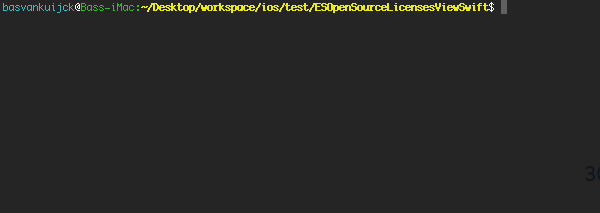
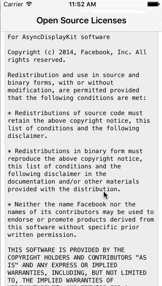

[](https://travis-ci.org/e-sites/ESOpenSourceLicensesKit)
[](http://cocoadocs.org/docsets/ESOpenSourceLicensesKit)
[](http://cocoadocs.org/docsets/ESOpenSourceLicensesKit)
[](https://cocoapods.org/pods/ESOpenSourceLicensesKit/quality)

# ESOpenSourceLicensesKit

*Requires Xcode 7.0 and Swift 2.0*

A script to automatically generate an HTML file of all the license files used with your CocoaPods Project

## Example

See [example-output.html](http://htmlpreview.github.io/?https://github.com/e-sites/ESOpenSourceLicensesKit/blob/master/Examples/example-output.html) for an example output

  

## Usage

### CocoaPods

Add the following lines to your PodFile:

```ruby
pod 'ESOpenSourceLicensesKit'

post_install do |installer_representation|
    system("ruby Pods/ESOpenSourceLicensesKit/ESOpenSourceLicensesKit/Scripts/generate_licenses.rb --post_install")
end
```
Run `pod update` or `pod install`

#### Swift
And then open a `ESOpenSourceLicensesViewController`:

```swift
import ESOpenSourceLicensesKit
        
let vc = ESOpenSourceLicensesViewController()
let navvc = UINavigationController(rootViewController: vc)
self.presentViewController(navvc, animated: true) { _ in
    
}
```

#### Objective-c (not recommended)

Make a swift / objc bridge.

And then open a `ESOpenSourceLicensesViewController`:

```objective-c
#import <ESOpenSourceLicensesViewController.h>

ESOpenSourceLicensesViewController *vc = [ESOpenSourceLicensesViewController new];
UINavigationController *navVc = [[UINavigationController alloc] initWithRootViewController:vc];
[self presentViewController:navVc animated:YES completion:nil];
```


### Manual 
Remember that the project depends on CocoaPods. Because it searches for LICENSE files within the `Pods` directory.
But if you prefer not to use this pod, you can manually call the bash script from your terminal:

```bash
cd /Path/to/xcode-workspace/
ruby ./generate_licenses.rb --input licenses.html
```

Then drag/drop the licenses.html file to your project and you can use it to load in a `UIWebView`

## Customization

```swift
let openSourceView = ESOpenSourceLicensesView()
openSourceView.licenseBackgroundColor = UIColor.blackColor()
openSourceView.licenseTextColor = UIColor.whiteColor()
```

- See [e-sites.github.io/ESOpenSourceLicensesKit](http://e-sites.github.io/ESOpenSourceLicensesKit/Classes.html)


## Todo

- [x] CocoaPods
- [x] Customization of the `ESOpenSourceLicensesKit`
- [x] Swift 1.2
- [x] Swift 2.0
- [ ] A .plist file of all the licenses
- [ ] An array representation of the license files
